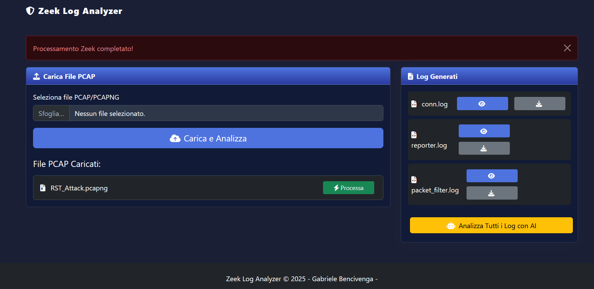
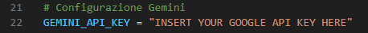
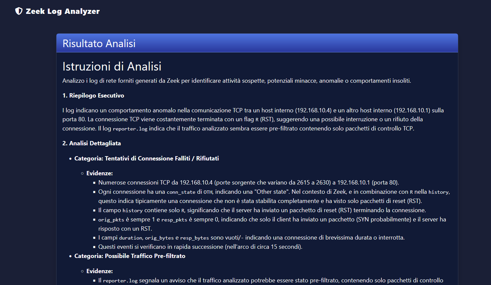
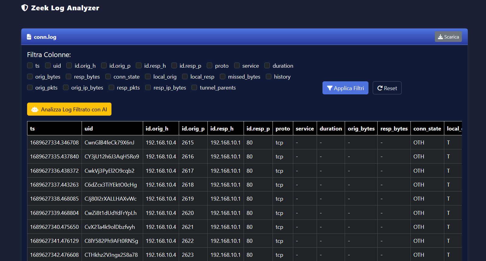

# Zeek Web GUI Analyzer

**The first Zeek Web GUI with built-in AI to analyze your PCAP files!**



---

## 📚 Table of Contents

- [🚀 Features](#-features)  
- [🔧 Requirements](#-requirements)  
- [📦 Python Dependencies](#-python-dependencies)  
- [🔑 Gemini API Key](#-gemini-api-key)  
- [🚀 Usage](#-usage)  
- [💡 Examples](#-examples)  
- [📁 Project Structure](#-project-structure)  
- [🤝 Contributing](#-contributing)  
- [📜 License](#-license)

---

## 🚀 Features

1. **PCAP/PCAPNG Upload**  
   Easily upload `.pcap` or `.pcapng` files through the web interface.

2. **Automatic Log Generation with Zeek**  
   Uploaded files are processed using Zeek, generating 20+ types of logs for in-depth analysis.

3. **Log Filtering Interface**  
   Browse and filter logs conveniently through the GUI to focus on relevant network activity.

4. **AI-Powered Analysis**  
   Analyze the entire set of logs with an integrated LLM (currently powered by Gemini API) for contextual and intelligent insights.

5. **Filtered/Truncated Log Analysis**  
   Optimize resources by sending only filtered logs to the AI for targeted analysis.

---

## 🔧 Requirements

- **Python**: 3.11 or higher  
- **Zeek** and `zeek-cut` binaries must be installed at:  
  `/usr/local/zeek/bin/`  
  *(Update the code if your binaries are located elsewhere)*

---

## 📦 Python Dependencies

Install the required Python modules using pip:

```bash
pip install flask werkzeug google-genai markdown
```

> Modules like `os`, `subprocess`, and `datetime` are part of the standard library.

---

## 🔑 Gemini API Key

To enable AI-powered analysis:

1. Obtain your [Google Gemini API key](https://ai.google.dev/gemini-api/docs/quickstart).
2. Set it as an environment variable or directly in the application:





Or set it in `.env` if you are using one.

---

## 🚀 Usage

1. **Clone the repository:**

```bash
git clone https://github.com/Gabbo01/ZeekWG
cd ZeekWG
```

2. **Start the Flask server:**

```bash
python app.py
```

3. **Open your browser and navigate to:**

```
http://localhost:5000
```

4. **Upload your `.pcap` / `.pcapng` file**  
   The logs will be automatically generated and viewable via the web interface.

5. **Filter logs** as needed and optionally **run AI analysis**.

---

## 💡 Examples

### Example 1: Full Log Analysis with AI

1. Upload a `.pcap` file.
2. Click **"Analyze All Logs"**.
3. The LLM will return insights and threat summaries across all logs.
   



### Example 2: Focused Log Analysis

1. Filter the `conn.log` to only show suspicious IPs.
2. Click **"Analyze Filtered Logs"**.
3. The AI receives only the relevant entries and returns focused insights.




---

## 📁 Project Structure

```
zeek-web-gui-analyzer/
├── app.py                 # Main Python Flask application
├── templates/             # HTML templates
├── uploads/               # Uploaded PCAPs
├── zeek_logs/             # Zeek-generated logs

```

---

## 🤝 Contributing

Feel free to open issues or submit pull requests! Suggestions, bug fixes, or new features are all welcome.

---

## 📜 License

APACHE 2.0 License. See `LICENSE` for details.
